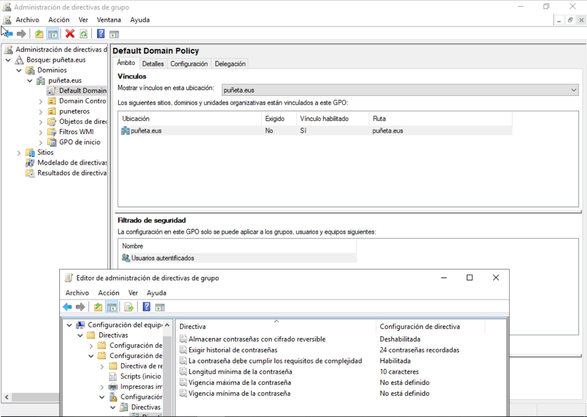

# Kontingentzia Plana

Sarrera\
Puñeteros S.L. informatika-denda bat da, ekipoak, periferikoak eta softwarea saltzen dituena, baita tailerrean laguntza teknikoa eta lineako zerbitzuak ere eskaintzen dituena. Enpresaren jarduera informatika-sistemen araberakoa da: fakturazioa, inbentarioaren kontrola eta bezeroen arreta, bai denda fisikoan bai webgunearen bidez.

Funtsezko aktiboak

* Windows Server zerbitzaria (Active Directory, DNS, DHCP, inprimaketa).\
  \

* Linux zerbitzaria (WordPress – lineako denda).\
  \

* Datu-basearen zerbitzaria (MySQL/MariaDB – inbentarioa eta bezeroak).\
  \

* Tailerreko ordenagailuak (diagnostikoa eta konponketa).\
  \

* Datu-sarea (switchak, routerrak, firewall-a, VPN).\
  \

* Datu sentikorrak: bezeroak, fakturazioa, inbentarioa.\
  \

* Langileak: saltzaileak, teknikariak, administrazioa.\
  \

Mehatxuak eta arriskuak

* Eraso informatikoak (phishing, ransomware, baimenik gabeko sarbideak).\
  \

* Giza akatsak (ezabaketa ustekabea, konfigurazio okerrak).\
  \

* Hardwarearen hutsegiteak (diskoak, iturriak, hornidura elektrikoaren etenak).\
  \

* Hondamendi fisikoak (sutea, uholdea, dendako lapurreta).\
  \

Prebentzio-neurriak

* Eguneroko segurtasun-kopiak (datu-basea eta inbentarioa).\
  \

* UPS (etenik gabeko elikadura-sistema).\
  \

* Firewall, IDS eta VPN kanpoko sarbideetarako.\
  \

* Pasahitzen politika sendoak eta aldaketa periodikoak.\
  \

* Antibirusa eguneratuta ekipo guztietan.\
  \

* Kontrol fisikoa: itxiturak, kamerak, biltegi eta zerbitzarirako sarbide-kontrola.\
  \

Berreskuratze-plana

* RTO (Recovery Time Objective): Zerbitzari kritikoak ≤ 4 ordu, PCak ≤ 24 ordu.\
  \

* RPO (Recovery Point Objective): Datu sentikorrak ≤ 1 egun.\
  \

* Prozedura: gorabehera identifikatu, kopiak aktibatu, sarearen berreskurapena → datu-basea → AD → webgunea, bezeroei jakinarazi.\
  \

* Arduradunak: sistemaren administratzailea, dendako arduraduna, zuzendaritza.

Gure zerbitzarian gpo-en bidez  gure enpresako erabiltzaileak eukiko duten politika egin dugu.

Gure enpresako erabiltzaileentzat erabili dugun pasahitzaren politika minimo 10 karaktere eukitzea,mayuskula,minuskula ,politika dominio guztieei aplikatu diogu&#x20;

\
